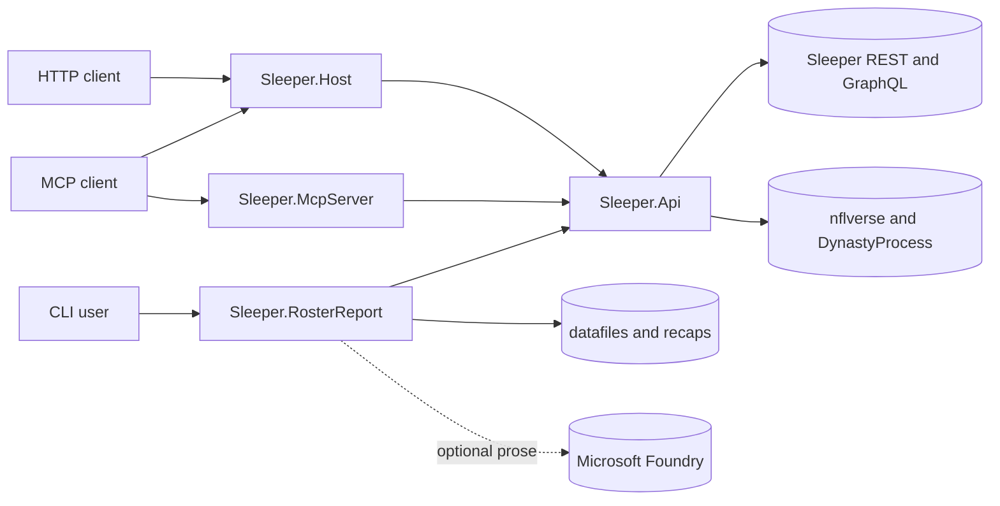

# Sleeper Public Platform Architecture

This repository contains the public Sleeper API client, MCP and HTTP surfaces, and
roster-reporting workflows. Draft assistance is intentionally maintained in the
separate private `sleeper-draftassist` repository and depends on this repository's
`Sleeper.Api` project.

## Solution map

| Project | Responsibility |
| --- | --- |
| `src/Sleeper.Api` | Sleeper HTTP access, caching, nflverse statistics, league scoring, reusable analysis, models, and the injury ledger |
| `src/Sleeper.McpServer` | Attribute-discovered Markdown MCP tools over shared API services |
| `src/Sleeper.Host` | Streamable HTTP MCP, REST wrappers, Swagger, and health endpoints |
| `src/Sleeper.RosterReport` | Player and team reports, roster history, weekly recaps, season artifacts, and optional Foundry prose |

Tests mirror these projects under `tests/`. The root `Sleeper.slnx` is the public
build boundary.



## Shared API and analysis kernel

`ISleeperClient` is the low-level contract for users, leagues, rosters, matchups,
transactions, players, NFL state, drafts, picks, and traded picks.
`SleeperClient` performs HTTP and JSON conversion. `CachedSleeperClient` decorates it
with endpoint-specific memory caching and same-key request coalescing.

`SleeperService` joins remote entities into league concepts such as named rosters
and scoreboards.

`NflDataClient` downloads nflverse statistics and DynastyProcess player-ID mappings.
`FantasyScorer` applies Sleeper scoring settings to raw statistics, while
`FantasyService` and `AnalysisService` expose player, roster, and ranking
analysis.

The injury subsystem stores historical observations separately from expiring,
source-specific current status. Imports operate only on a persisted consumer-defined
cohort. Historical nflverse rows never become current status.

Consumers should register this layer through:

```csharp
services.AddSleeperApi();
services.AddNflData();
```

## MCP and HTTP surfaces

`Sleeper.McpServer` discovers tools from `Sleeper.McpServer.Tools` and serves them over
stdio. `Sleeper.Host` serves the same tool implementations over streamable HTTP at
`/mcp` and exposes thin REST wrappers under `/api`.

Tool methods own input validation, cancellation propagation, error conversion, and
Markdown formatting. REST endpoints should delegate to those methods rather than
duplicate business logic.

The host also exposes:

- `/swagger`
- `/health`
- `/`

## Reporting and recaps

`Sleeper.RosterReport` owns CLI parsing, deterministic report data, recap envelopes,
season aggregation, charts, and optional prose generation.

The deterministic boundary is important: remote data and calculations are assembled
before any optional Foundry call. When Foundry is unavailable, deterministic reports
and artifacts remain usable.

Persistent reporting inputs and outputs include:

| Path | Purpose |
| --- | --- |
| `datafiles/<season>/week-NN.json` | Kickoff-locked roster history |
| `datafiles/<season>/transactions.json` | Transaction history |
| `datafiles/<season>/asset-movement-audit.json` | Asset movement evidence |
| `recaps/<season>/week-NN.md` | Weekly recap |
| `recaps/<season>/season.md` | Season summary |
| `recaps/<season>/*.json` | Deterministic recap and season sidecars |

See `docs/reporting-cli.md`, `docs/league-lore.md`, and the Foundry documentation for
the detailed command and prose contracts.

## Configuration and local data

- `src/Sleeper.RosterReport/appsettings.json` contains checked-in defaults.
- `appsettings.Development.json`, environment variables, and user secrets provide
  local overrides.
- `.sleeper-data/` contains local runtime data such as the SQLite injury ledger and is
  not committed.

No private draft projections, draft sessions, draft strategies, or draft dashboard
assets belong in this repository.

## Validation

```powershell
dotnet build Sleeper.slnx --no-restore
dotnet test Sleeper.slnx --no-build --no-restore
```

Run integration tests deliberately because they call live external services. For
transport changes, run `Sleeper.Host` and inspect Swagger.

## Change boundaries

1. Keep remote data access and reusable analysis in `Sleeper.Api`.
2. Keep MCP tool behavior shared between stdio and HTTP transports.
3. Keep report facts deterministic and separate from optional generated prose.
4. Treat CLI arguments, artifact schemas, endpoint routes, and MCP tool signatures as
   public contracts.
5. Do not add private DraftAssist implementation or licensed projection data here.
