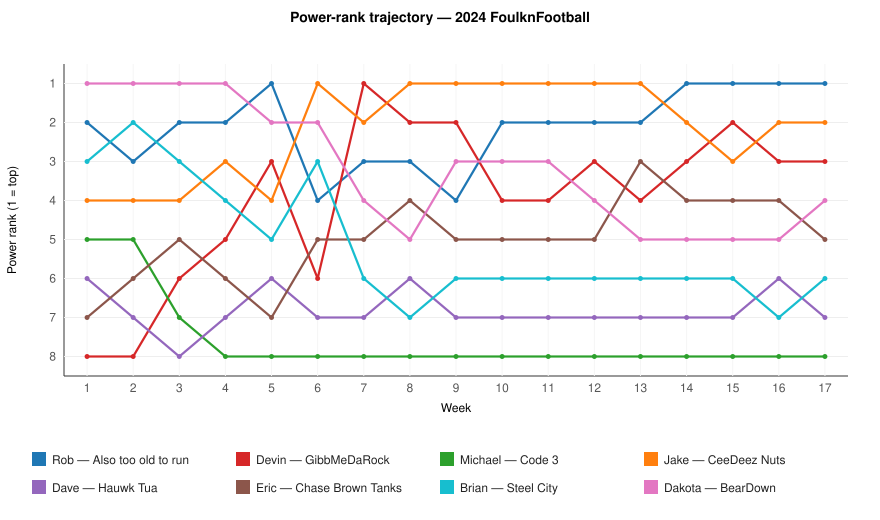
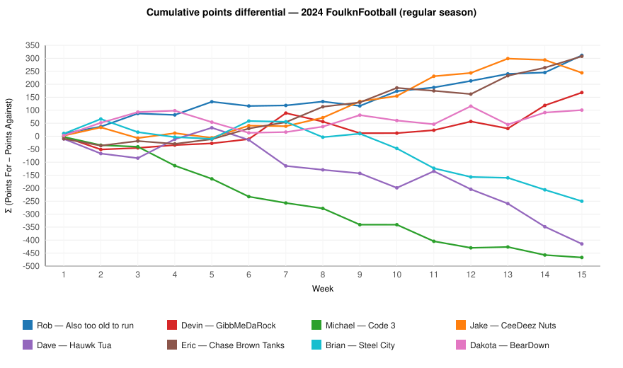
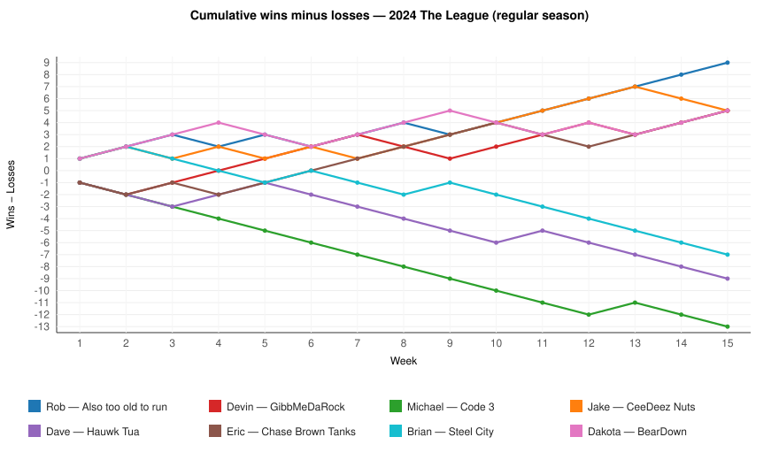
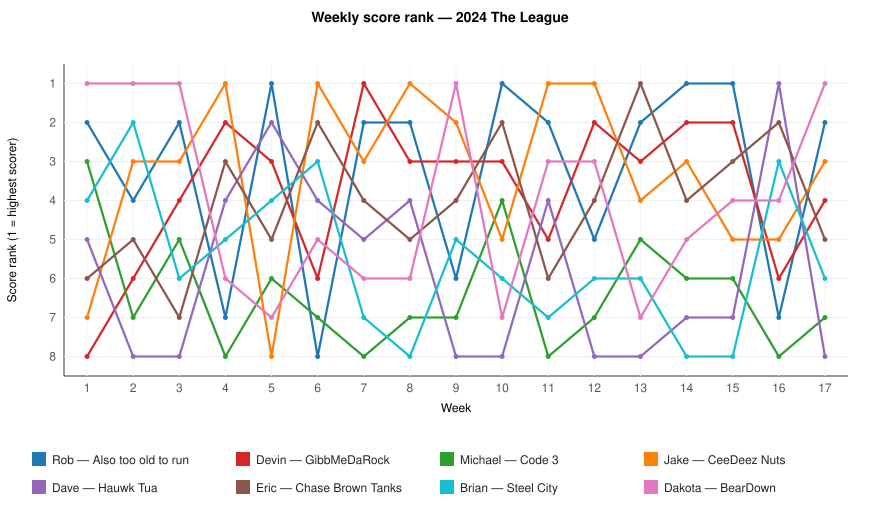

# 2024 FoulknFootball — Season in Review

_Generated 2026-04-27 01:38 UTC. League ID `1112858215559057408`._

## 🏆 Jake's CeeDeez Nuts — 2024 FoulknFootball Champion

_Defeated Eric's Chase Brown Tanks in the championship. Dakota's BearDown won the consolation bowl and the 1.01 next year. Michael's Code 3 finishes last and forfeits a keeper next season (3 of 4 instead of 4)._

## Charts

## Champion crowned

Jake’s CeeDeez Nuts are the champions of the 2024 season. The title was earned the hard way. After a 10-5 regular season and 3206.08 total points across the full year, CeeDeez Nuts took the bracket route all the way through and finished it in Week 17 with the last win that mattered, 175.46 to 167.08 over Chase Brown Tanks.

There was a steadiness to Jake’s year that fit the moment. CeeDeez Nuts spent seven weeks at No. 1 in the power ranks, produced five weekly high scores, and still had to come through a playoff field that included GibbMeDaRock in the semifinal and Eric in the championship. The final was not about noise. It was about having enough left, and Jake did.

## Season arc

The year opened with BearDown setting the tone. Dakota took the weekly high score in Weeks 1, 2, and 3, started 4-0, and for a while the league moved on Dakota’s schedule. Then the season widened. Also too old to run kept showing up with big totals, CeeDeez Nuts found another gear, and GibbMeDaRock began climbing out of an early hole.

That climb belonged to Devin more than anyone. GibbMeDaRock moved from No. 8 in Week 1 to No. 2 by Week 15, a six-spot rise that was the biggest in the league, and Week 7 became the cleanest snapshot of it: 249.76, the highest single-week score of the year, plus the largest blowout of the season against Hauwk Tua. Sometimes a team announces itself all at once, and that was the afternoon.

At the top, Rob’s Also too old to run looked like the strongest regular-season team by several measures. Rob climbed from No. 2 to No. 1 in the power ranks, led the league in regular-season points differential at +311.34, and claimed the points crown with 2856.20 in the regular season. Week 14, when Also too old to run slipped past CeeDeez Nuts for first place, felt like the regular season narrowing to its center line.

Not everyone held their ground. BearDown fell four spots in the power ranks from No. 1 to No. 5, the biggest drop among the fallers, while Code 3 slid from No. 5 to No. 8 and Steel City from No. 3 to No. 6. Those trajectories tell part of the story, but the sharper point is this: in an eight-team league, there was not much room to drift, and the teams that lost footing stayed exposed.

## Champion's path

Jake’s bracket path was clear and efficient. CeeDeez Nuts reached the championship game by beating GibbMeDaRock in the semifinal, then closed the season by beating Chase Brown Tanks in the title game. The regular season gave Jake a strong base, but the postseason asked for two more wins against teams that had spent much of the year near the top, and CeeDeez Nuts answered both times.

There is also something worth noting in the timing. Jake lost in Weeks 14 and 15, including the first-place game against Also too old to run, then reset in the playoffs and won the two games that decided everything. That is a short sentence, but it says a lot about fantasy seasons. The standings shape the bracket, and then the bracket asks a different question.

Eric’s Chase Brown Tanks earned the runner-up finish with an impressive push of its own. Eric climbed three power-rank spots from No. 7 to No. 4, finished the regular season with a +307.72 points differential, and took down Also too old to run in the semifinal before falling just short in Week 17. It was a serious contender’s year, even without the last trophy photo.

## Loser's saga

Code 3 finishes last, and the league rule is plain: Michael forfeits one keeper next year and may keep only 3 of 4. The record ended at 1-16, and the regular season included a 12-game losing streak, which also stood as the longest in the league. There were narrow losses tucked inside it, including the Week 10 defeat to GibbMeDaRock by 0.08, and those are usually the ones that stay with you longer.

The hard part for Code 3 is that the cold stretches were real and the floor was low, from the season-low 107.74 in Week 4 to the league-worst regular-season points total. The silver lining in the bottom half belongs to BearDown. Dakota won the consolation final, finished fifth, and secured the 1.01.

## Power-rank story

The trajectory chart says Devin had the biggest rise. GibbMeDaRock climbed from No. 8 in Week 1 to No. 2 in Week 15, up six spots, and no team changed the shape of its season more dramatically. Eric’s Chase Brown Tanks also moved well, from No. 7 to No. 4, while Rob’s Also too old to run improved from No. 2 to No. 1 and then backed it up with the league’s best regular-season points differential at +311.34 on the cumulative-points-differential chart.

The largest slide belonged to BearDown, which fell from No. 1 to No. 5, down four spots after that strong opening run. Code 3 and Steel City each dropped three spots as well, and both spent much of the second half trying to stop the drift rather than reverse it. As for the top line, CeeDeez Nuts held the No. 1 power rank the longest at seven weeks. That matters because the chart did not crown Jake by itself, but it did show how often the league circled back to the same conclusion.

## Looking ahead to next year

- **Dakota — BearDown (1.01)** — A 12-5 team that started fast, cooled off, and still turned the consolation bracket into the top pick.
- **Dave — Hauwk Tua (1.02)** — Hauwk Tua struggled through a 4-13 year, but the consolation run at least pushed the draft position near the front.
- **Brian — Steel City (1.03)** — Steel City opened as a contender, faded into a five-win finish, and now gets an early reset in the draft.
- **Michael — Code 3 (1.04)** — Code 3 finished 1-16 and last in the league, so next year comes with a middle-of-the-lottery pick and a roster restriction. Keeper forfeiture: keeps 3 of 4 next year.
- **Devin — GibbMeDaRock (1.05)** — The biggest climber in the power ranks carried that rise to fourth place, which leaves Devin drafting from the middle after a real push.
- **Rob — Also too old to run (1.06)** — Rob posted the best regular-season profile in the league and finished third, so the reward is a later pick and another strong baseline.
- **Eric — Chase Brown Tanks (1.07)** — Eric’s runner-up finish came with one of the league’s best point differentials, and the price of that success is waiting until 1.07.
- **Jake — CeeDeez Nuts (1.08)** — The champion goes to the back of the line, and Jake will make that walk as the owner who finished the bracket.

## Final standings

| Final | Team | Owner | Reg-season W-L-T | Reg-season PF | Total W-L-T (incl. playoffs) | Total PF | Path | Next year's pick |
|---:|---|---|:---:|---:|:---:|---:|---|:---:|
| 🥇 | CeeDeez Nuts | Jake | 10-5-0 | 2843.28 | 12-5-0 | 3206.08 | Won championship | **1.08** |
| 🥈 | Chase Brown Tanks | Eric | 10-5-0 | 2676.38 | 11-6-0 | 3040.36 | Lost in championship | **1.07** |
| 🥉 | Also too old to run | Rob | 12-3-0 | 2856.20 | 13-4-0 | 3208.36 | Won 3rd-place game | **1.06** |
| 4 | GibbMeDaRock | Devin | 10-5-0 | 2777.74 | 10-7-0 | 3129.74 | Lost 3rd-place game | **1.05** |
| 5 | BearDown | Dakota | 10-5-0 | 2637.90 | 12-5-0 | 3022.36 | Won consolation final (1.01) | **1.01** |
| 6 | Hauwk Tua | Dave | 3-12-0 | 2360.78 | 4-13-0 | 2705.68 | Lost consolation final | **1.02** |
| 7 | Steel City | Brian | 4-11-0 | 2416.76 | 5-12-0 | 2771.66 | Won 7th-place game | **1.03** |
| 8 | Code 3 | Michael | 1-14-0 | 2215.28 | 1-16-0 | 2539.14 | Lost 7th-place game (finishes last; forfeits a keeper) | **1.04** (forfeits a keeper) |

_Next year's draft order: champion picks last (1.08); consolation-bowl winner picks first (1.01); last place forfeits one keeper (3 of 4 instead of 4)._

## Awards (canonical)

| Award | Winner | Metric | Value | Citation |
|---|---|---|---:|---|
| **Single-Week Showstopper** | Devin — GibbMeDaRock | single-week points for | 249.76 | Scored 249.76 in week 7. |
| **The Cold Front** | Michael — Code 3 | single-week points for | 107.74 | Scored 107.74 in week 4. |
| **Biggest Blowout** | GibbMeDaRock | margin of victory | 100.20 | GibbMeDaRock 249.76 def. Hauwk Tua 149.56 (week 7). |
| **Razor's Edge** | GibbMeDaRock | margin of victory | 0.08 | GibbMeDaRock 152.44 def. Code 3 152.36 (week 10). |
| **Upset of the Year** | Hauwk Tua | margin of victory (lower-power-ranked team) | 72.84 | Hauwk Tua (power #8) over Code 3 (power #7) by 72.84 (week 4). |
| **Points Crown** | Rob — Also too old to run | regular-season points for | 2856.20 | Scored 2856.20 across the regular season. |
| **Iron Team** | Rob — Also too old to run | consecutive regular-season wins | 6.00 | Won 6 regular-season games in a row. |
| **The Cooler** | Michael — Code 3 | consecutive regular-season losses | 12.00 | Lost 12 regular-season games in a row. |
| **Comeback Team** | Devin — GibbMeDaRock | power-rank delta (W1 → final regular-season week, lower is better) | 6.00 | Climbed 6 power-rank spots between week 1 and week 15. |
| **Heartbreak of the Year** | Michael — Code 3 | close losses (margin ≤ 5) | 2.00 | Suffered 2 regular-season losses by 5 points or fewer. |

## Best moments — week by week

- **Week 1** — **BearDown edges Code 3 behind Barkley, survives Allen’s answer.**
- **Week 2** — **BearDown rides Kamara past GibbMeDaRock and keeps pace at the top.**
- **Week 3** — **BearDown stays unbeaten as Dakota’s depth carries past Jake.**
- **Week 4** — **GibbMeDaRock outlasts Chase Brown Tanks as Devin wins the week’s heaviest scoreline.**
- **Week 5** — **Also too old to run keeps rolling, and Code 3 pays for the quiet spots.**
- **Week 6** — **Jake answers Dave with a Week 6 number that held all day.**
- **Week 7** — **GibbMeDaRock bury Hauwk Tua behind a Lamar-led avalanche.**
- **Week 8** — **CeeDeez Nuts end GibbMeDaRock’s run with a bigger top line.**
- **Week 9** — **Dakota and BearDown turn back Devin with a bigger ground game.**
- **Week 10** — **Rob and Also too old to run answer with the week’s biggest number against Brian and Steel City.**
- **Week 11** — **Rob and Also too old to run hold off Dakota’s BearDown in a game that cleared 400.**
- **Week 12** — **Jake and CeeDeez Nuts outlast Eric’s 188-point Sunday.**
- **Week 13** — **Rob and Also too old to run answer Devin’s big number with a bigger one.**
- **Week 14** — **Father vs Son: Also too old to run slips past CeeDeez Nuts for first place.**
- **Week 15** — **Brother Bowl: Rob closes the regular season on top with a decisive victory.**
- **Week 16** — **Brother Bowl: Hauwk Tua survives Steel City and moves on.**
- **Week 17** — **Cousin vs Nephew: Jake brings the trophy home for CeeDeez Nuts.**

---

_Machine-readable companions: `season-aggregate.json`, `season-awards.json`, `season-outcome.json`, `manifest.json`. Each chart in `charts/` carries a `data-source:` comment naming the JSON field it was derived from, so a future agent can re-render them deterministically._
