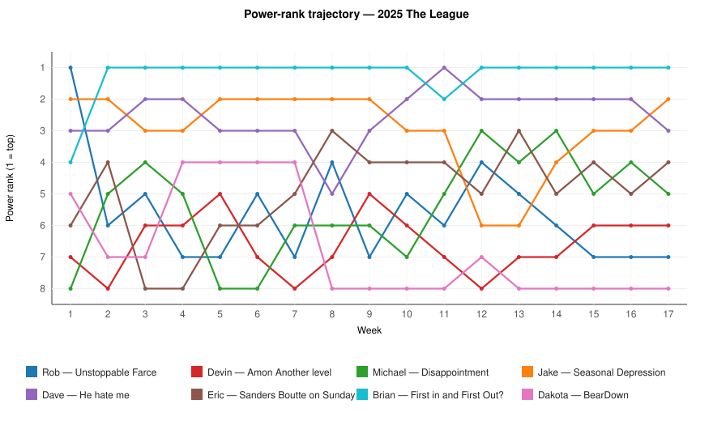
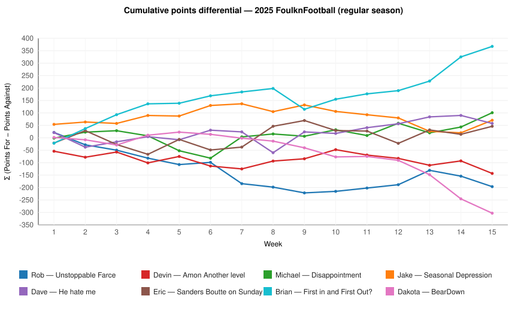
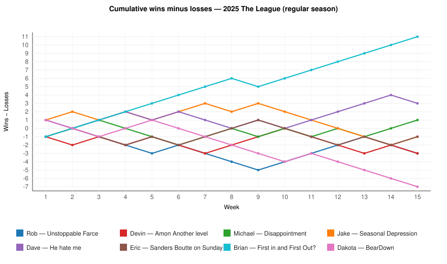
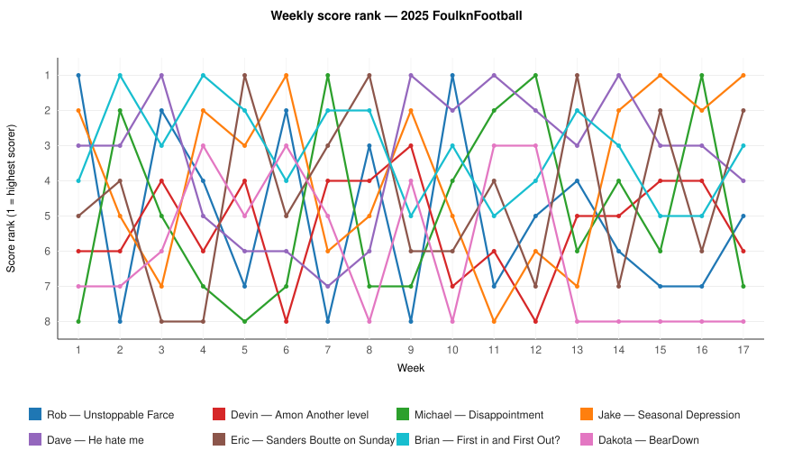

# 2025 FoulknFootball — Season in Review

_Generated 2026-04-27 00:59 UTC. League ID `1180276953741729792`._

## 🏆 Jake's Seasonal Depression — 2025 FoulknFootball Champion

_Defeated Michael's Disappointment in the championship. Eric's Sanders Boutte on Sunday won the consolation bowl and the 1.01 next year. Dakota's BearDown finishes last and forfeits a keeper next season (3 of 4 instead of 4)._

## Charts

## Champion crowned

Jake’s Seasonal Depression is the champion of the 2025 season. The team finished the job in Week 17 with a clear win over Michael’s Disappointment, and the title lands with a little more weight when you remember the road it took to get there. Seasonal Depression scored 3045.40 points across the full year, won the championship, and did it after entering the playoffs as a team that had spent much of the fall proving it could absorb a rough stretch without losing its place in the race.

There was no need for decoration at the end. Seasonal Depression won its semifinal, came back the next week, and handled the final cleanly. In a league that spent most of the year chasing one regular-season standard, Jake’s team chose a better time to play its best football.

## Season arc

The shape of the year started with Rob’s Unstoppable Farce setting the early pace. Week 1 belonged to Unstoppable Farce at 198.54, and for a moment the name fit the standings as well as the joke. Then the long turn began, and by Week 15 the biggest faller in the power-rank story was clear: Unstoppable Farce slid from No. 1 to No. 7, a drop of six spots that matched the feel of the middle months.

At the top, Brian’s First in and First Out? gave the league its most consistent standard. Brian climbed from No. 4 to No. 1 by Week 15, a rise of three spots, and then stayed there for 15 weeks overall. The weekly digests kept returning to the same theme. Week 2 was a 232.48 statement against He hate me. Week 4 was another firm answer. By the time the trajectory chart settled in, First in and First Out? had become the team everyone measured themselves against.

Still, the regular season was not a one-team story. Dave’s He hate me posted the best regular-season points total at 2823.12 and produced the single highest week of the year with 249.78 in Week 9, a number that turned the table on Brian and reminded everyone that volume still matters in an 8-team room. Michael’s Disappointment also changed the conversation. Starting at No. 8 and climbing to No. 5 by Week 15, up three spots, Disappointment spent the year looking better than the team name and eventually better than most of the bracket.

There were quieter climbs as well. Eric’s Sanders Boutte on Sunday moved from No. 6 to No. 4, a two-spot rise that fit a team which never quite owned the center of the stage but kept finding useful weeks, including weekly-high honors in Weeks 5, 8, and 13. On the other side, Dakota’s BearDown fell from No. 5 to No. 8, and the cumulative-points-differential table made the challenge plain. Some teams lost ground a little at a time. BearDown lost it in chunks.

## Champion's path

Seasonal Depression did not enter the postseason with the regular-season aura of First in and First Out?, nor with the points-crown profile of He hate me. Jake entered at 9-8 overall by final record and took the direct path the bracket asked for: win the championship semifinal, then win the championship. That is what happened. In Week 16, Seasonal Depression beat First in and First Out? 197.02 to 176.98, which was the kind of result that changes how a season is remembered. A team can spend months looking solid. It takes one semifinal to look inevitable.

Then came Week 17, and the title game turned into a composed finish. Seasonal Depression beat Disappointment 187.60 to 139.18. The championship round did not ask Jake to scrape by. It asked for control, and that is what the final looked like. One brief family note was unavoidable here: a father’s team name sat in the league history, but the son took the trophy.

Michael’s Disappointment deserves the full runner-up line. The team recovered from an opening-week loss, authored the Upset of the Year in Week 7 with that 247.10 burst against Unstoppable Farce, climbed three power-rank spots from Week 1 to Week 15, and then reached the final by beating He hate me in Week 16. The last game got away, but the arc held.

## Loser's saga

Dakota’s BearDown finishes last, and in this league that carries a real cost. The rule is straightforward: last place forfeits one keeper next year, so BearDown will keep only 3 of 4. The numbers tell the same story. BearDown finished 4-13, posted the lowest regular-season points total at 2259.08, and carried the league’s longest regular-season losing streak at five games. Week 14 brought the coldest single week of the year at 79.68, and that score also sat on the wrong side of the season’s biggest blowout.

There is at least one useful contrast in the bottom half. Rob’s Unstoppable Farce won the 7th-place game and avoided the last-place tag, while Eric’s Sanders Boutte on Sunday took the better prize by winning the consolation final. That result gives Eric fifth place and the 1.01, which is the cleanest silver lining available outside the title bracket.

## Power-rank story

The trajectory chart is unusually clean this year. Brian’s First in and First Out? was one of the biggest climbers, moving from No. 4 in Week 1 to No. 1 in Week 15, a climb of three spots, and it also held the No. 1 power rank for 15 weeks. Michael’s Disappointment matched that three-spot climb, going from No. 8 to No. 5, while Eric’s Sanders Boutte on Sunday added a quieter rise from No. 6 to No. 4. Those are different kinds of progress, but all three moved in the right direction when the season settled.

The fallers were just as revealing. Rob’s Unstoppable Farce had the sharpest drop, falling from No. 1 to No. 7, down six spots, while Dakota’s BearDown slipped from No. 5 to No. 8 and Jake’s Seasonal Depression moved from No. 2 to No. 3 by a single spot. The cumulative-points-differential chart helps explain why the regular season looked one way and the playoffs another. First in and First Out? finished at +367.36, far ahead of the field, while Seasonal Depression sat at +70.46 and still left with the trophy. That is fantasy football in one sentence: control what you can for four months, then answer two weekends.

## Looking ahead to next year

- **Eric — Sanders Boutte on Sunday (1.01)** — A fifth-place finish became a useful springboard when Sanders Boutte on Sunday won the consolation final and turned a steady late climb into the first pick.
- **Devin — Amon Another level  (1.02)** — Amon Another level  finished sixth after a 7-10 year, and the second pick gives Devin a chance to firm up a team that hovered around the middle without fully escaping it.
- **Rob — Unstoppable Farce (1.03)** — Unstoppable Farce opened at the top of the power ranks and ended in seventh, so pick 1.03 arrives after the league’s steepest slide.
- **Dakota — BearDown (1.04)** — BearDown finished last at 4-13 and takes pick 1.04 into a reset year. Keeper forfeiture: keeps 3 of 4 next year.
- **Dave — He hate me (1.05)** — He hate me led the league in regular-season points and claimed several of the year’s biggest scoring moments, but a fourth-place finish leaves Dave drafting from the middle.
- **Brian — First in and First Out? (1.06)** — First in and First Out? spent nearly the entire year at No. 1 and posted the best regular-season differential, yet the path closed in the semifinal and third place sets Brian at 1.06.
- **Michael — Disappointment (1.07)** — Disappointment turned a three-spot power-rank climb into a runner-up finish, and the seventh pick now goes to a team that looks sturdier than its name.
- **Jake — Seasonal Depression (1.08)** — The champion drafts last, and Seasonal Depression earned 1.08 the proper way by winning the bracket when it mattered most.

## Final standings

| Final | Team | Owner | Reg-season W-L-T | Reg-season PF | Total W-L-T (incl. playoffs) | Total PF | Path | Next year's pick |
|---:|---|---|:---:|---:|:---:|---:|---|:---:|
| 🥇 | Seasonal Depression | Jake | 7-8-0 | 2660.78 | 9-8-0 | 3045.40 | Won championship | **1.08** |
| 🥈 | Disappointment | Michael | 8-7-0 | 2535.10 | 9-8-0 | 2887.88 | Lost in championship | **1.07** |
| 🥉 | First in and First Out? | Brian | 13-2-0 | 2821.08 | 14-3-0 | 3181.62 | Won 3rd-place game | **1.06** |
| 4 | He hate me | Dave | 9-6-0 | 2823.12 | 9-8-0 | 3192.30 | Lost 3rd-place game | **1.05** |
| 5 | Sanders Boutte on Sunday | Eric | 7-8-0 | 2620.80 | 9-8-0 | 2967.64 | Won consolation final (1.01) | **1.01** |
| 6 | Amon Another level  | Devin | 6-9-0 | 2459.28 | 7-10-0 | 2807.86 | Lost consolation final | **1.02** |
| 7 | Unstoppable Farce | Rob | 6-9-0 | 2503.10 | 7-10-0 | 2830.78 | Won 7th-place game | **1.03** |
| 8 | BearDown | Dakota | 4-11-0 | 2259.08 | 4-13-0 | 2502.32 | Lost 7th-place game (finishes last; forfeits a keeper) | **1.04** (forfeits a keeper) |

_Next year's draft order: champion picks last (1.08); consolation-bowl winner picks first (1.01); last place forfeits one keeper (3 of 4 instead of 4)._

## Awards (canonical)

| Award | Winner | Metric | Value | Citation |
|---|---|---|---:|---|
| **Single-Week Showstopper** | Dave — He hate me | single-week points for | 249.78 | Scored 249.78 in week 9. |
| **The Cold Front** | Dakota — BearDown | single-week points for | 79.68 | Scored 79.68 in week 14. |
| **Biggest Blowout** | First in and First Out? | margin of victory | 97.18 | First in and First Out? 176.86 def. BearDown 79.68 (week 14). |
| **Razor's Edge** | BearDown | margin of victory | 1.42 | BearDown 139.42 def. Disappointment 138.00 (week 1). |
| **Upset of the Year** | Disappointment | margin of victory (lower-power-ranked team) | 85.50 | Disappointment (power #8) over Unstoppable Farce (power #5) by 85.50 (week 7). |
| **Points Crown** | Dave — He hate me | regular-season points for | 2823.12 | Scored 2823.12 across the regular season. |
| **Iron Team** | Brian — First in and First Out? | consecutive regular-season wins | 7.00 | Won 7 regular-season games in a row. |
| **The Cooler** | Dakota — BearDown | consecutive regular-season losses | 5.00 | Lost 5 regular-season games in a row. |
| **Comeback Team** | Michael — Disappointment | power-rank delta (W1 → final regular-season week, lower is better) | 3.00 | Climbed 3 power-rank spots between week 1 and week 15. |

## Best moments — week by week

- **Week 1** — **Rob’s Unstoppable Farce opens with a steady Week 1 win over Brian.**
- **Week 2** — **Brian turns a projected toss-up into a clear Week 2 answer.**
- **Week 3** — **He hate me has the steadier answers in a 207.50–185.96 win over Unstoppable Farce.**
- **Week 4** — **Brian stays on top as First in and First Out? handles Devin.**
- **Week 5** — **Brian holds off Jake as First in and First Out? edges Seasonal Depression.**
- **Week 6** — **Rob gets the last word as Unstoppable Farce slips past Dakota.**
- **Week 7** — **Michael gets the fuller card as Disappointment rolls past Rob.**
- **Week 8** — **Brian’s stars hold the line as First in and First Out? turns back Rob.**
- **Week 9** — **Dave and He hate me turn the table on Brian.**
- **Week 10** — **Rob gets just enough from the depth, and Unstoppable Farce slips past Dave.**
- **Week 11** — **Dave gets the better of Michael as He hate me stays hot.**
- **Week 12** — **Jaxon Smith-Njigba lifts Dave past Dakota in a game that outran the forecast.**
- **Week 13** — **Dave’s depth carries He hate me past Devin in Week 13.**
- **Week 14** — **Old Guard vs Young Guns: Dave holds off Jake in a Week 14 high-stakes battle.**
- **Week 15** — **Jake’s Seasonal Depression answers the pressure and closes the regular season with a decisive victory.**
- **Week 16** — **Father vs Son: Michael sends Disappointment to the FoulknFootball title game.**
- **Week 17** — **Jake crowns Seasonal Depression champion with a clear final over Michael.**

---

_Machine-readable companions: `season-aggregate.json`, `season-awards.json`, `season-outcome.json`, `manifest.json`. Each chart in `charts/` carries a `data-source:` comment naming the JSON field it was derived from, so a future agent can re-render them deterministically._
